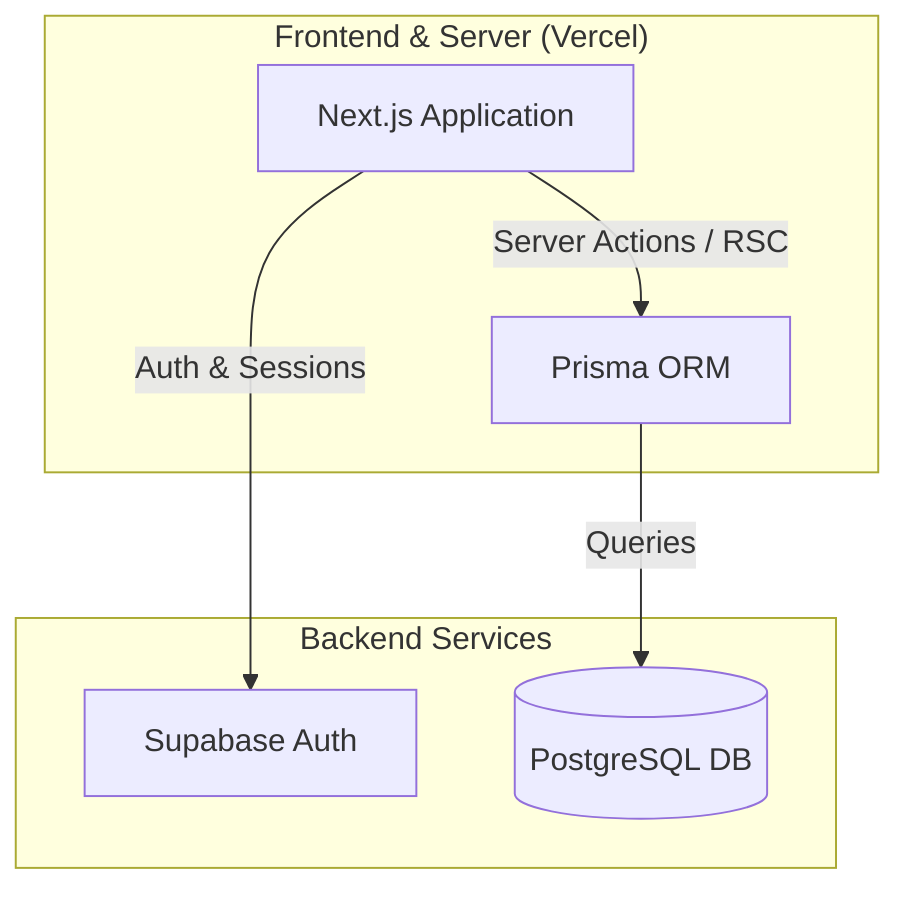
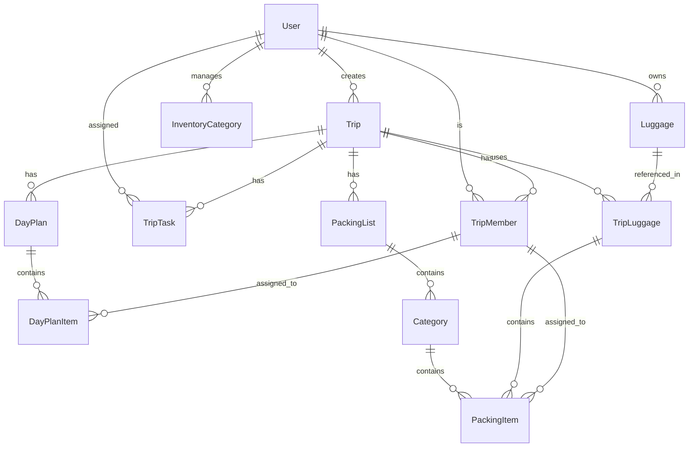
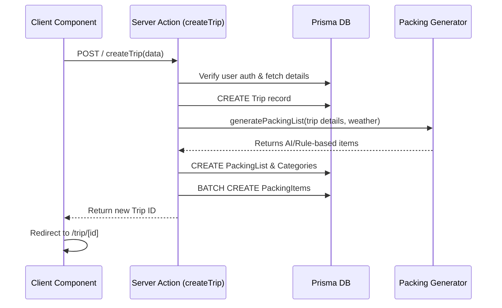

# Packwise System Architecture

This document provides a detailed overview of the system architecture for **Packwise**, a smart packing list application. It captures the high-level components, backend database connections, data models, and the major flows of the application.

## High-Level Architecture

Packwise is built on a modern full-stack web architecture using **Next.js 14 (App Router)**.

### Components
1. **Frontend & Server (Next.js 14)**:
   - **React Server Components (RSC)**: Used heavily in the `app/` directory (e.g., `app/dashboard/page.tsx`, `app/trip/[id]/page.tsx`) to fetch data directly on the server, reducing the amount of JavaScript sent to the client.
   - **Client Components**: Interactive UI components (e.g., `TripPageClient.tsx`) that use React state and hooks, hydrating on the client side.
   - **Server Actions**: Located in the `actions/` directory. These replace traditional API routes and handle data fetching and mutations (e.g., `createTrip`, `getDashboardTrips`). They are called directly from both Server and Client Components.

2. **Backend & Database**:
   - **Prisma ORM**: The primary way the Next.js application interacts with the database (`lib/prisma.ts`). It provides a type-safe client generated from `prisma/schema.prisma`.
   - **PostgreSQL**: The relational database hosting the application data (accessed via `DATABASE_URL` and `DIRECT_URL`).
   - **Supabase**: Handles user authentication (`@supabase/ssr` with `lib/supabase/server.ts` and `lib/supabase/client.ts`). The application relies on Supabase for Auth sessions, while maintaining its own `User` table in PostgreSQL mapped via `supabaseId`.

## Data Models & Core Schemas

The application revolves around several key entities defined in `prisma/schema.prisma`.

### Key Entities
- **User (`users`)**: Represents authenticated users. Linked to Supabase via `supabaseId`. Owns Trips, Inventory, Luggage, and Tasks.
- **Trip (`trips`)**: The central entity representing a travel event. Contains details like destination, dates, type, and weather data.
- **TripMember (`trip_members`)**: Supports collaborative trips. Associates a user (optional) to a specific Trip.
- **PackingList (`packing_lists`) & Category (`categories`)**: Groups packing items for a trip.
- **PackingItem (`packing_items`)**: Individual items to be packed. Can be assigned to a `TripMember` or placed in specific `TripLuggage`. Tracks the `isPacked` status.
- **Luggage (`luggage`) & TripLuggage (`trip_luggage`)**: Users define their luggage inventory. `TripLuggage` joins Luggage to a specific Trip, allowing items to be packed into specific bags.
- **DayPlan (`day_plans`) & DayPlanItem (`day_plan_items`)**: Allows users to plan their itinerary day-by-day for a trip.
- **InventoryItem (`inventory_items`)**: A user's personal inventory of items they frequently pack, categorized by `InventoryCategory`.
- **TripTask (`trip_tasks`)**: To-do items associated with a trip (e.g., "Book flights", "Renew passport").

## Major Application Flows

### 1. User Authentication Flow
1. User logs in or signs up via Supabase Auth (Email or OAuth).
2. On successful auth, the session is managed via cookies (`@supabase/ssr`).
3. Next.js middleware or Server Components (e.g., `app/dashboard/page.tsx`) verify the session using `supabase.auth.getSession()`.
4. The Supabase User ID (`user.id`) maps to the `supabaseId` in the Prisma `User` model, which acts as the foreign key for all user-owned records.

### 2. Trip Creation & Packing List Generation

- When a trip is created, the system uses the destination, weather, and trip duration to automatically generate a tailored `PackingList`.
- This happens synchronously during the Server Action.

### 3. Packing Progress & Interactivity
1. **Render**: `app/trip/[id]/page.tsx` (Server Component) fetches the `Trip`, `PackingList`, `Categories`, and `PackingItems` via Prisma.
2. **Hydration**: Data is passed to `TripPageClient.tsx` and child components.
3. **Action**: User clicks a checkbox to mark a `PackingItem` as packed.
4. **Mutation**: A Server Action (e.g., `updatePackingItemStatus`) is called.
5. **Update**: The database updates `is_packed` to `true`. Next.js `revalidatePath` triggers the Server Component to re-render and send the updated UI to the client.

### 4. Planning Board & Itinerary (Day Plans)
- The user can view a Kanban-style Planning Board (`PlanningBoardView`).
- **Data Flow**: `DayPlan` and `DayPlanItem` records are fetched.
- Users can drag and drop items between days or change item order. Client-side state handles optimistic UI updates, while Server Actions sync the final positions (`dayPlanId`, `order`) to the PostgreSQL database.

## Opportunities for Improvement

### 1. Data Models

**Opportunity A: Jsonb vs Related Tables for Weather Data**
Currently, `weather` data is stored as a `Json?` field on the `Trip` model.
- **Option 1: Keep as JSONB**
  - *Pros:* Extremely flexible. External API responses can be dumped directly into the column. Fast to write.
  - *Cons:* Hard to query or index specific weather conditions (e.g., "Find all trips where temperature > 30C"). Can lead to bloated row sizes if the JSON is large.
- **Option 2: Normalize Weather Data into a new `TripWeather` table**
  - *Pros:* Strongly typed schema. Enables complex analytics and querying (e.g., tracking average temperatures across all user trips).
  - *Cons:* Increases query complexity (requires a JOIN). Requires mapping external API data to specific columns.

**Opportunity B: Luggage Capacity Management**
Currently, `Luggage` has `capacity` (Int) and `capacityLiters` (Float).
- **Option 1: Consolidate to a single unit of measurement (e.g., Liters)**
  - *Pros:* Eliminates redundancy and potential inconsistencies in the database. Simplifies the UI/UX.
  - *Cons:* Requires a data migration to unify the fields and update existing records.
- **Option 2: Abstract Capacity to a generic `Size` Enum (Small, Medium, Large) + Liters**
  - *Pros:* Easier for users to categorize standard bags without knowing exact liters.
  - *Cons:* Less precise for users who want to calculate exact volume constraints for airlines.

### 2. Performance Enhancements

**Opportunity A: Reducing N+1 Queries in Server Components**
Next.js Server Components make it easy to fetch data, but it's common to accidentally introduce N+1 query problems if child components fetch their own data in a loop.
- **Option 1: Aggregated Prisma Queries (e.g., `include`)**
  - *Pros:* Fetches all necessary nested relations (Trip -> PackingLists -> Categories -> Items) in a single database roundtrip. Very performant for reads.
  - *Cons:* Can result in massive payload sizes if the relations are deeply nested and contain a lot of data, potentially slowing down serialization and network transfer.
- **Option 2: Parallel Fetching with `Promise.all`**
  - *Pros:* If independent data points are needed (e.g., Trip details and User preferences), fetching them in parallel speeds up response time.
  - *Cons:* Does not solve deeply nested relational data issues as cleanly as ORM-level joins.

**Opportunity B: Caching Strategy (Next.js Data Cache)**
Currently, data relies heavily on dynamic rendering or standard database queries per request.
- **Option 1: Implement Next.js `unstable_cache` or standard `fetch` caching for static data (like Inventory suggestions)**
  - *Pros:* Drastically reduces database load for read-heavy, infrequently changing data. Faster TTFB (Time to First Byte).
  - *Cons:* Requires careful management of cache invalidation (`revalidateTag` or `revalidatePath`) to ensure users don't see stale data.
- **Option 2: Redis Caching Layer**
  - *Pros:* Highly scalable, distributed cache independent of the Next.js cache. Great for session data or rate-limiting.
  - *Cons:* Adds infrastructure complexity and maintenance overhead.

### 3. Architecture Enhancements

**Opportunity A: Optimistic UI Updates vs Standard Server Actions**
Currently, interactions like checking off a packing item rely on Server Actions and `revalidatePath`, which requires a server roundtrip before the UI fully updates.
- **Option 1: Implement React `useOptimistic` hook**
  - *Pros:* Instant feedback for the user. The UI feels incredibly snappy, essential for a mobile-friendly packing app where users check off many items rapidly.
  - *Cons:* Increased frontend complexity. Requires handling rollback logic if the Server Action fails (e.g., network error).
- **Option 2: Client-side State with debounced background sync**
  - *Pros:* Reduces the number of requests sent to the server. Good for rapid, batch updates (like reordering a packing list).
  - *Cons:* Risk of data loss if the user closes the app before the sync completes.

**Opportunity B: Monolith vs Microservices for External Integrations**
As Packwise grows (e.g., adding deeper weather integration, flight tracking, AI generation).
- **Option 1: Keep as a Next.js Monolith**
  - *Pros:* Simple deployment (Vercel), single codebase, shared types. Excellent for current scale.
  - *Cons:* Long-running tasks (like complex AI itinerary generation) can hit Vercel Serverless Function timeout limits (10-60 seconds depending on plan).
- **Option 2: Extract heavy tasks to a Background Worker (e.g., Inngest, Trigger.dev, or AWS SQS + Lambda)**
  - *Pros:* Reliable execution of long-running or failure-prone external API calls. Decouples core web request lifecycle from heavy processing.
  - *Cons:* Significant architectural overhead. Requires setting up webhooks and async polling for the UI to know when the task is done.
